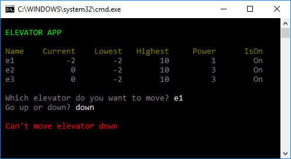
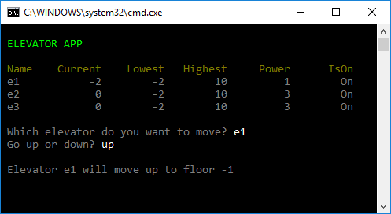
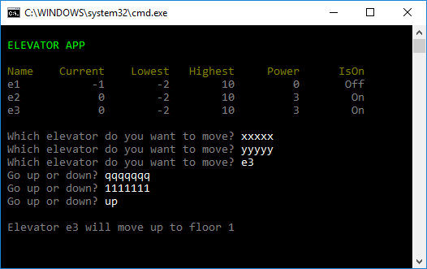

# Styra hissar

## Intro

Skapa en applikation för att hantera ett antal hissar. Användaren ska kunna skicka upp och ner valfria hissar.

## Syfte

Syftet med denna uppgift:
- lära sig modellera verkligheten med klasser
- lära sig skriva tester för att verifiera att koden funkar

## Uppgift

Börja med att läsa in en textfil som innehåller ett antal hissar. För varje hiss är det angivet:
- Namn
- Startvåning
- Lägsta möjliga våning
- Högsta möjliga våning
- Power = hur mycket hissen kan förflytta sig innan den behöver underhåll

Här är en exempelfil *elevators.txt* med tre hissar:

    e1,0,-2,10,3
    e2,0,-2,10,3
    e3,0,-2,10,3

Startskärmen visar alla hissar och dess status:

Användaren skickar ner hissen *e1* en våning:

Användaren skickar ner hissen *e1* ytterligare en våning:

Användaren försöker skickar ner *e1* men den har nått botten på hiss-schaktet:

Användaren skickar upp hiss *e1*:

Användaren försöker skicka ner hiss *e1* men den har ingen *power* kvar. Behöver underhållas:

Exempel när användaren skriver felaktiga värden:

## Test

Skapa ett testprojekt **ElevatorApp.Test** med en testklass i.

Skapa ett tiotal tester som verifierar att din Elevator-klass beter sig som väntat

Döp testerna enligt detta mönster:

    "Should [be in some state] [after/before/when] [action takes place]"

t.ex

    [TestMethod]
    public void elevator_should_be_at_level_2_when_it_starts_at_1_and_go_up_one_floor()
    {
    }

## Tips

Låt ditt huvudprogram se ut såhär:

        static void Main()
        {
            List<Elevator> elevators = LoadElevatorsFromFile();

            while (true)
            {
                DisplayHeader();
                DisplayStatus(elevators);
                Elevator elevator = AskWhichElevatorToMove(elevators);
                Direction direction = AskForDirection();
                ElevatorMoveResponse response;

                if (direction == Direction.Up)
                    response = elevator.TryGoUp();
                else
                    response = elevator.TryGoDown();

                DisplayResponse(response, elevator, direction);

            }

        }

Gör en **Elevator**-klass med följande metoder

    public ElevatorMoveResponse TryGoUp()
    public ElevatorMoveResponse TryGoDown()

**ElevatorMoveResponse** är en *enum* som talar om det gick bra att flytta hissen

Gör två konstruktorer till Elevator:

    Elevator(string name, int lowestFloor, int highestFloor)    
    Elevator(string name, int lowestFloor, int highestFloor, int startFloor, int untilMaintainance)

Properties för en Elevator:

- Name 
- LowestFloor
- HighestFloor
- CurrentFloor
- UntilMaintainance 
- PowerIsOn

## Extra

Utöka projeten på valfritt sätt. T.ex 
- Låt användaren skapa valfritt antal hissar
- Rita ett grafiskt gränsnitt (med textgrafik) där en kan ser hissar som åker upp och ner
- Separera hiss-schakt från hissar (olika klasser)
- Lägg till personer som är på olika våningar och vill ta en hiss åt olika håll. Flera hissar, flera personer. Simulering. AI.